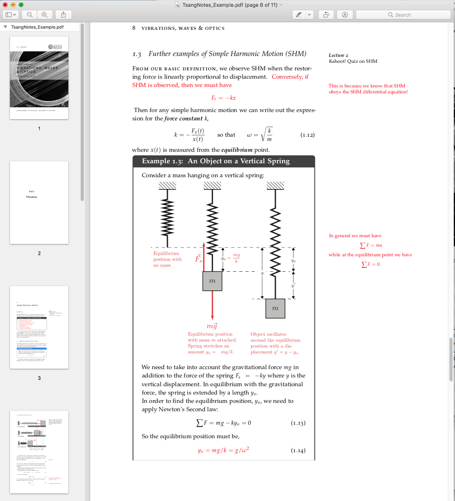
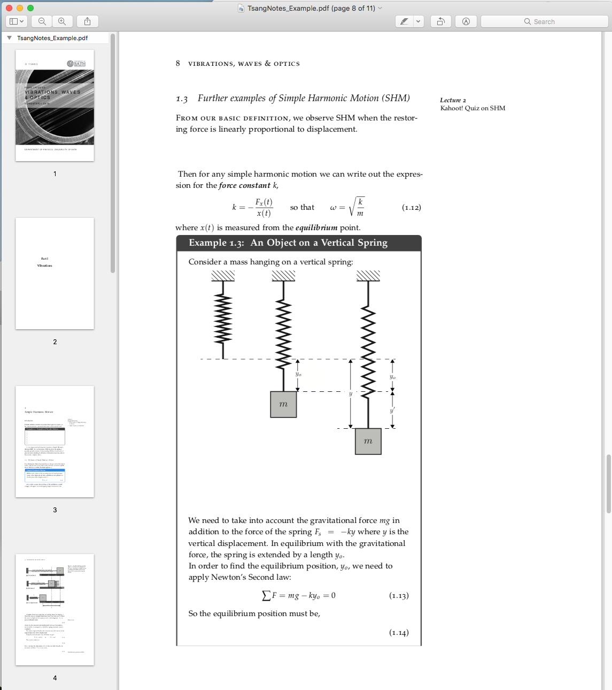

# Dave's LaTeX Class Notes Template

David Tsang - D.Tsang@soton.ac.uk

2018/08/24

This is a template for skeletal class notes based on the tufte-book class.
Copy TsangNotes.sty and TsangNotes.cls into your local LaTeX directory

     \documentclass[options..]{TsangNotes}

# Class Options:

  	skeletal : skeletal notes, sets text color of things in \p{...} to white
	          (except for align environment equation numbers).
		  Also uses un-annotated image from \pincludegraphics{...}{..}
		  (see below)

	full : force full notes, sets text color of things in \p{...} to red
	       (except for align environment equation numbers).
	       Also uses annotated image from \pincludegraphics{...}{...}

	accessible : sets all the text to sans serif, including equations

All other options will be passed to tufte-book (e.g. the ones for UK notes are usually "a4ppaer, openany, notoc")

If no TsangNotes class specific options are set, it will default to the "full" behaviour. As an alternative to the class options (for command line options and makefiles) you can set the definitions

      	\def\student{}  in order to set skeletal notes on

	\def\accessible{} in order to set accessible fonts on

Note that the class options override the \defs above  if they conflict.

#Class Commands:

       \logo[offset]{PATH} sets the path to the logo file to load next to
       the title you can use the offset in length units (cm, pts etc)
       in order to shift the image up or down

       \coverimage[SCALE]{PATH} sets the background cover image for the
       title page. SCALE (with fixed aspect ratio) by a fraction of the
       page width

       \p{...} hides the text if the notes are the "skeletal" version
       (by setting text color to white). You can use this surrounding
       entire align environments, but the equation numbers will stay black.
       In the "full" version everything in \p{...} will appear red. 

       \pincludegraphics{unannotated_path}{annotated_path} places graphics
       that are either "unannotated_path" for "skeletal" version, or
       "annotated_path" for the "full" version.

# Boxes

Several TikZ boxes are provided for displaying examples, exercises and
emphasis.

## mybox

	\begin{mybox}[width=WIDTH]{TITLE}

	...
	
	\end{mybox}

This provides an unnumbered box with heading: "TITLE" with a blue/ocean coloured border. The box has width \textwidth by default. Set this to \pagewidth if you want it to span the page. 

## examplebox

	\begin{examplebox}[width=WIDTH]{TITLE}

	...
	
	\end{examplebox}

This provides a numbered example box with heading: "Example CHAP.EXNUM: TITLE"
that is by default has width \textwidth. Set this to \pagewidth if you want it to span the page.

## exercisebox

	\begin{exercisebox}[width=WIDTH]{TITLE}

	...
	
	\end{exercisebox}

This provides a numbered example box with heading: "Exercise CHAP.EXERCISENUM: TITLE"
that is by default has width \textwidth. Set this to \pagewidth if you want it to span the page. This box has a red border.

# Samples:

## full

## skeletal

The example text and figures are  © 2018 David Tsang. Cover image "guitarstrings.jpg" modified from "12 String Theory" by Paul VanDerWerf (http://www.flickr.com/photos/pavdw/23500305076/), licensed under a Creative Commons Attribution 2.0 License (http://creativecommons. org/licenses/by/2.0/legalcode). The University of Bath logo is a trademark of the University of Bath. 